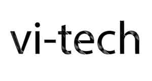

# vitech

tuyển chọn các tài liệu về công nghệ bằng tiếng Việt

https://www.facebook.com/vitech4.0/

Giới thiệu
-----------------------
vi-tech tập hợp các tài liệu về công nghệ bằng tiếng việt trong nhiều lĩnh vực - thuật toán, AI, phỏng vấn/tìm việc,...

người quản lý hiện tại:
- Duc Ngo (sw engineer - facebook)
- Phong Dinh (sw engineer - facebook)

các bạn có thể đóng góp bài viết qua phương thức contribute thông thường của github.
[hướng dẫn](https://github.com/TeamworkTCU/4305-FOSSD-Project/wiki/C%C3%A1ch-th%E1%BB%A9c-l%E1%BA%A5y-m%C3%A3-v%C3%A0-%C4%91%C3%B3ng-g%C3%B3p-m%C3%A3-ngu%E1%BB%93n)

Ghi chú 
-----------------------
Vui lòng dẫn nguồn và tác giả bài viết khi đăng. 

Một số các bài viết ở đây được trích từ [thư viện VNOI](http://vnoi.info/wiki/Home).

Các tài liệu tương tác (Jupyter Notebook)
-----------------------
Các tài liệu tương tác được soạn dưới dạng Jupyter Notebook giúp bạn vừa theo dõi tài liệu vừa tương tác được với code (Python).

Để mở tài liệu các bạn cài Jupyter (http://jupyter.org/install), clone repo vitech về máy tính, và chạy "jupyter notebook"

Hướng dẫn Deep Learning với Pytorch
-   [Bài 1 - cơ bản về Tensor](jupyter/pytorch-tutorials/ch1-tensor.ipynb)

Kinh nghiệm phỏng vấn
-----------------------

-   [Những kinh nghiệm chung khi phỏng vấn](interview/kinh-nghiem-chung-khi-phong-van.md)
-   [Cơ hội làm việc tại Facebook](interview/co-hoi-facebook.md)
-   [Kinh nghiệm phỏng vấn Google](interview/kinh-nghiem-phong-van-google.md)
-   [Kinh nghiệm phỏng vấn - Góc nhìn từ người phỏng vấn](interview/kinh-nghiem-phong-van-vien.md)

AI Trí tuệ nhân tạo
-----------------------
-   [Machine Learning 101 (1): Làm quen](ai/ml-101-lam-quen.md)
-   [Những vấn đề cơ bản về mạng neuron](ai/neural-network-101.md)
-   [Cơ bản về PyTorch](ai/pytorch-101.md)
